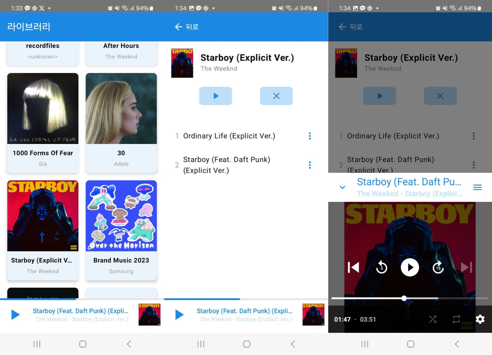
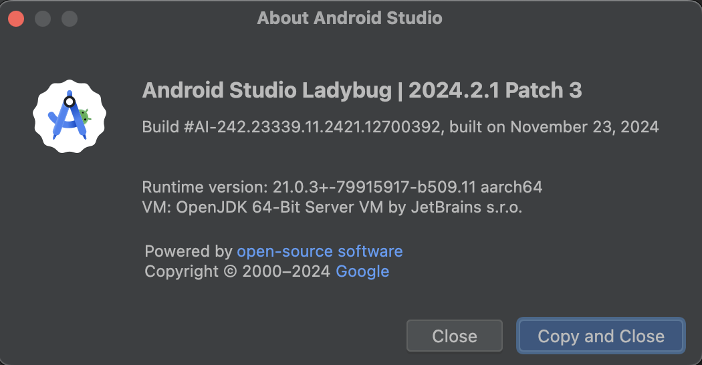

# Music Player Sample App

This is the repository for the Music Player Sample App.

Music Player Sample App is a fully functional Android app built entirely with Kotlin and Jetpack Compose. This app was designed and built in the design case study, architecture learning journey and modularization learning journey.

# Features

The Music Player Sample App displays the device's audio content. Users can play the content. Users can use basic player functions, such as pause and shuffle playback.

## Screenshots



# Development Environment

Music Player Sample App uses the Gradle build system and can be imported directly into Android Studio.

## Recent build successful version



# Architecture

Music Player Sample App uses MVI patterns and clean architectures.

# Modularization

The Music Player Sample App is modularized. It follows the Clean Architecture principles, dividing the project into data, domain, and presentation layers, with the playback functionality also modularized.

```jsx
     ┌─ presentation ┐
app ─┤               ├─ domain
     └──── data ─────┘
             └───────── playback
```

# Build

The app contains the usual debug and release build variants.

# Testing

To facilitate testing of components, Music Player Sample App uses dependency injection with Hilt.

The tests are categorized by functionality:  
Data tests: Each of the repositories, preferences, etc.  
Presentation tests: Each of the ViewModel logic, screen UI, etc.

# UI

The Screens and UI elements are built entirely using Jetpack Compose.
